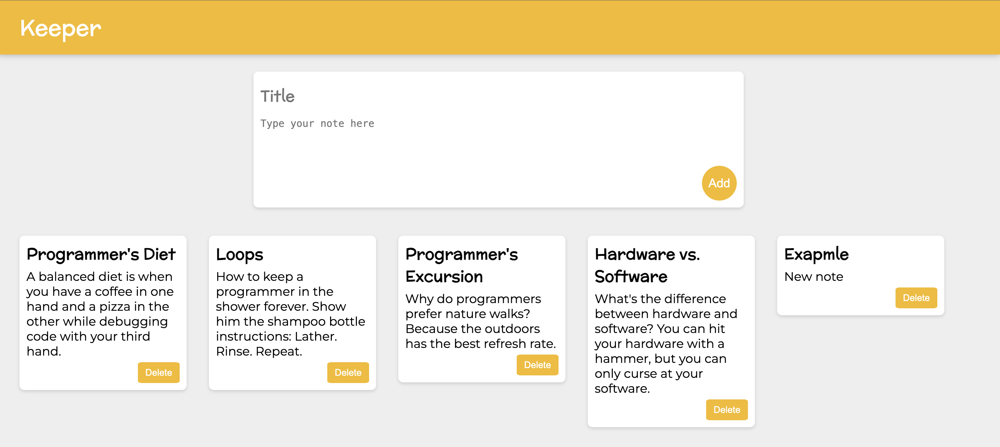

# Getting Started with Notes Keeper App

## About

Notes Keeper: Simplify your note-taking. Create, edit, and delete notes with ease. Stay organized effortlessly.

## Clone the Repository:

### `git clone https://github.com/your-username/notes-keeper-app.git`

## Navigate to the Project Directory:

### `cd notes-keeper-app`

## Install Dependencies:

### `npm install`

## Run the App:

### `npm start`

## Open in Your Browser:

Open http://localhost:3000 in your web browser.

## How to Use

Create new notes by entering a title and content.
Delete notes by clicking the delete button.

## Technologies Used

React.js
JavaScript
HTML/CSS
Contributing

Feel free to contribute, report issues, or suggest improvements!

Happy coding! 🚀